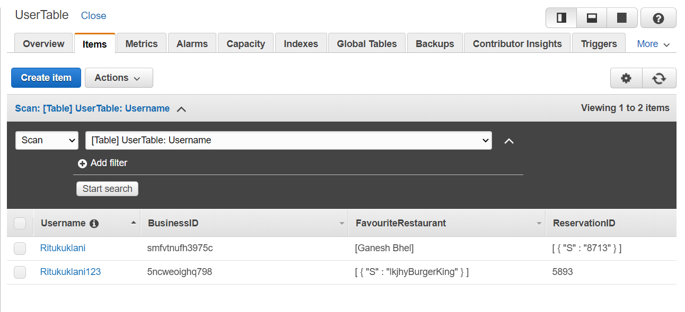
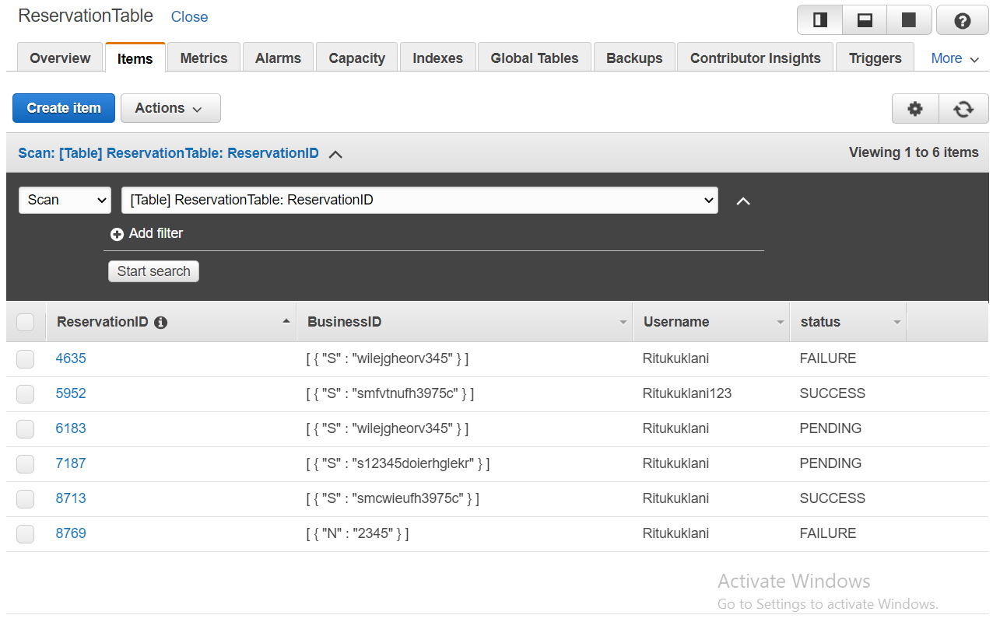

###Here is the API gateway endpoint to test the functionality.
`https://euybnvh6j6.execute-api.us-east-1.amazonaws.com/dev`

###Example

The endpoints are as follows:
1. /register:
`https://euybnvh6j6.execute-api.us-east-1.amazonaws.com/dev/registeruser`

We can register the user by entering a username and password.
We have to enter a `username` and `password` in the body field. 
Have created a HTTP PUT request to register the user. 
The username and password generate a token_id which can then be used during login.
The token_id is created using AWS Cognito service, which creates a pool of users.
This user data is also added to DynamoDb.
This token_id can then be added to the headers Authentication field for login and other functionalities.

2. /login: 
`https://euybnvh6j6.execute-api.us-east-1.amazonaws.com/dev/login`

We add the token_id to the `Authentication field` in the login header.
We also have to check if the `Content-Type` is `application/json`

3. /reserve
`https://euybnvh6j6.execute-api.us-east-1.amazonaws.com/dev/login/reserve`

We add the token_id to the `Authentication field` in the header.
We need to add the business_id of the restaurant where we want to reserve a table.

4. /setFavourite
`https://euybnvh6j6.execute-api.us-east-1.amazonaws.com/dev/login/setfavourite`

We add the token_id to the `Authentication field` in the header.
We need to add the name of our favourite restaurant to body of the HTTP request

5. /unsetFavourite
`https://euybnvh6j6.execute-api.us-east-1.amazonaws.com/dev/login/unsetfavourite`

We add the token_id to the `Authentication field` in the header.
We need to add the name of the restaurant that we want to remove from our faourites.

6. /getBusiness
`https://euybnvh6j6.execute-api.us-east-1.amazonaws.com/dev/getbusiness`

We add the token_id to the `Authentication field` in the header.
We need to add the location around which we will get Business ids and business names of restaurants
to dine in.
